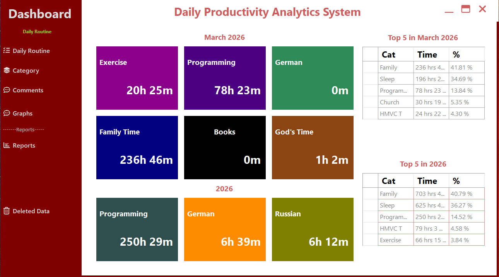
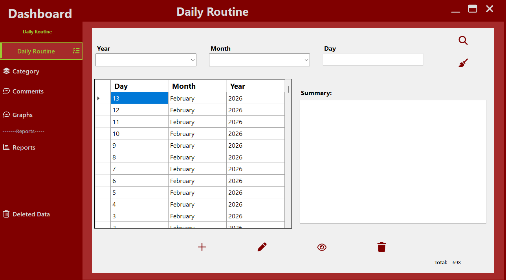
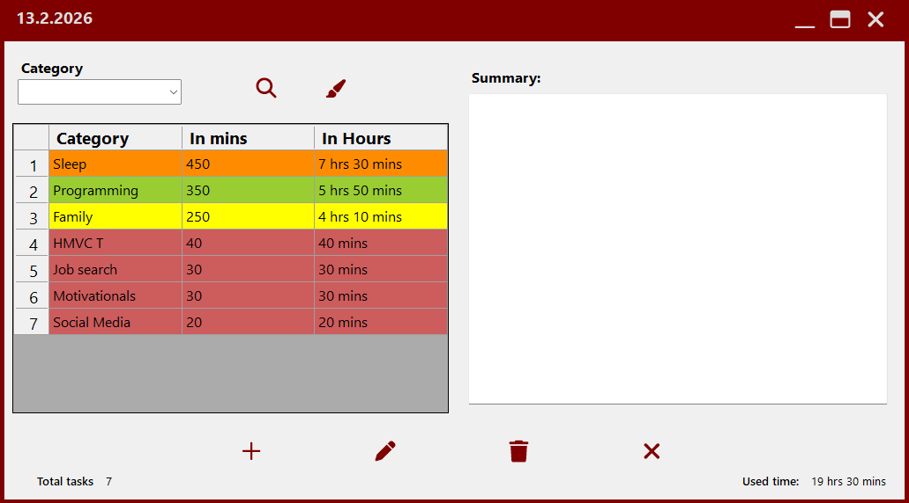
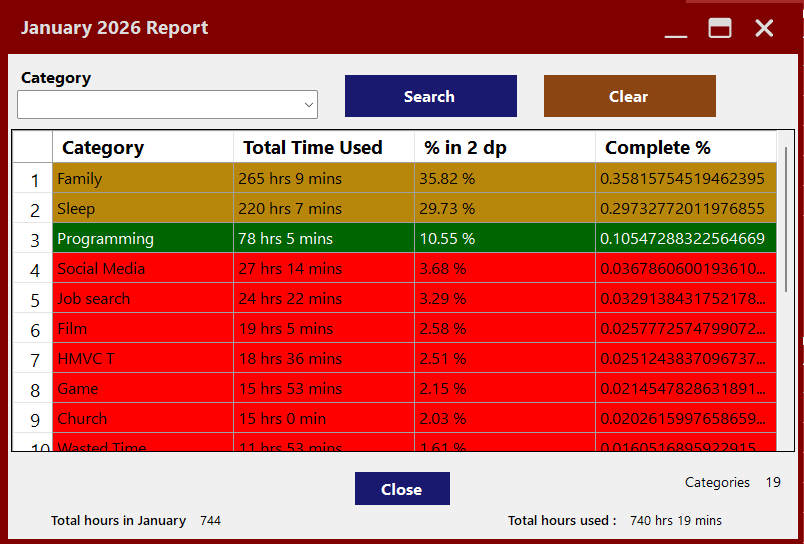
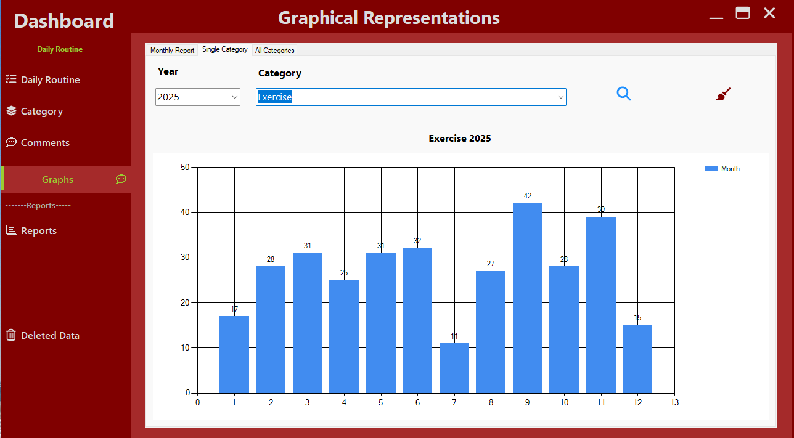
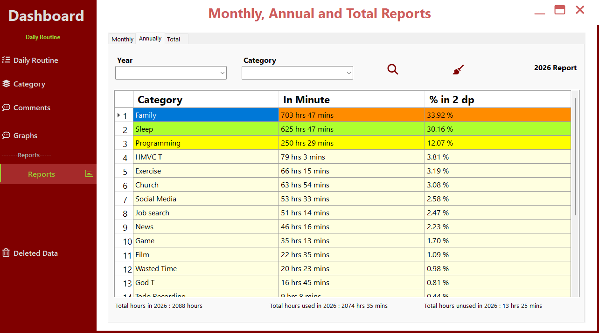

### RoutineAPP – Daily Productivity Analytics System

## Overview
RoutineAPP is a desktop-based productivity and time analytics system developed using C# and .NET Framework.

The application was initially designed for structured personal productivity tracking
but was architected using a modular and layered design, making it suitable for
general-purpose time management and analytical reporting.

The system has been actively used in production for over two years, demonstrating
long-term stability, maintainability, and real-world usability.

## Architecture
The application follows a structured 3-Tier Layered Architecture, ensuring 
separation of concerns and maintainable code organization.

#### Presentation Layer
- Windows Forms (UI)
- Responsible for user interaction and data presentation
- Located in AllForms
- Fully decoupled from database logic

#### Business Logic Layer (BLL)
- Encapsulates application rules
- Handles validation and aggregation logic
- Coordinates communication between UI and Data Layer
- Implements generic IBLL<T> interface for structured abstraction
- Centralizes calculation and reporting logic

#### Data Access Layer (DAL)
- DAO (Data Access Object) pattern implementation
- DTO (Data Transfer Object) pattern for structured data exchange
- Entity Framework (Database-First, EDMX model)
- Soft delete strategy (isDeleted, deletedDate) for safe record management
- Encapsulated and isolated database operations


## Analytics & Reporting Engine
The system includes a fully integrated productivity analytics module with structured
statistical reporting capabilities.
#### Core Features:
- Daily activity logging with persistent storage
- Category-based time tracking and distribution
- Monthly aggregated reporting (GROUP BY month logic)
- Yearly productivity summaries per category
- Total hours per category per year
- Average hours per month calculations
- Dynamic bar chart visualization per selected category
- Cross-category comparison dashboard (monthly & annual)
- Time-series sorting and historical search functionality
- Centralized dashboard summary screen for productivity overview


#### Statistical Processing

Data aggregation and statistical calculations are performed using structured LINQ queries and database-level filtering to ensure:


- Accurate time summation
- Efficient grouped queries
- Optimized ordering by year → month → day
- Clean separation between calculation logic (BLL) and persistence logic (DAL)

This design ensures scalability, maintainability, and clear responsibility 
boundaries between layers.

````
+--------------------------------------------------+
|                  Presentation Layer              |
|--------------------------------------------------|
| Windows Forms (AllForms)                        |
| - Dashboard                                     |
| - Daily Routine Forms                           |
| - Reports & Graph Forms                         |
+-------------------------▲------------------------+
                          |
                          |
+-------------------------|------------------------+
|               Business Logic Layer (BLL)        |
|--------------------------------------------------|
| - DailyTaskBLL                                   |
| - CategoryBLL                                    |
| - GraphBLL                                       |
| - ReportsBLL                                     |
| - MonthBLL / YearBLL                             |
|                                                  |
| Handles:                                         |
| - Validation                                     |
| - Aggregation Logic                              |
| - Statistical Calculations                       |
+-------------------------▲------------------------+
                          |
                          |
+-------------------------|------------------------+
|               Data Access Layer (DAL)           |
|--------------------------------------------------|
| DAO                                              |
| - DailyTaskDAO                                   |
| - CategoryDAO                                    |
| - ReportsDAO                                     |
| - MonthDAO / YearDAO                             |
|                                                  |
| DTO                                              |
| - DailyTaskDTO                                   |
| - DailyTaskDetailDTO                             |
| - ReportDTO                                      |
| - GraphDTO                                       |
|                                                  |
| Entity Framework (EDMX - Database First)        |
+-------------------------▲------------------------+
                          |
                          |
+-------------------------|------------------------+
|                    Microsoft SQL Server          |
|--------------------------------------------------|
| Tables:                                          |
| - DAILY_ROUTINE                                  |
| - MONTHs                                         |
| - TASK                                           |
| - CATEGORY                       |
+--------------------------------------------------+
````

## Data Flow
````

1. User interacts with Windows Forms UI.
2. UI sends request to BLL.
3. BLL performs validation and statistical calculations.
4. BLL calls DAO layer.
5. DAO interacts with Entity Framework.
6. Entity Framework executes queries against MSSQL.
7. Results are mapped into DTOs and returned upward.
````

## 🗄 Database Schema
````

    CATEGORY {
        int categoryID PK
        string categoryName
        bool isDeleted
        datetime deletedDate
    }

    MONTH {
        int monthID PK
        string monthName
    }

    DAILY_ROUTINE {
        int dailyRoutineID PK
        datetime routineDate
        string summary
        int day
        int monthID FK
        int year
        bool isDeleted
        datetime deletedDate
    }

    TASK {
        int taskID PK
        int categoryID FK
        int dailyRoutineID FK
        int monthID FK
        int year
        int day
        decimal timeSpent
        string summary
        bool isDeleted
        datetime deletedDate
    }

    MONTH ||--o{ DAILY_ROUTINE : contains
    DAILY_ROUTINE ||--o{ TASK : includes
    CATEGORY ||--o{ TASK : classifies
    MONTH ||--o{ TASK : groups
````

````
 Database Design Overview

The database follows a normalized relational structure:

- DAILY_ROUTINE represents a specific calendar day entry.
- TASK represents categorized time entries associated with a routine.
- CATEGORY provides classification for activity tracking.
- MONTH acts as a lookup reference table.

Soft delete strategy is implemented across core tables using:
- isDeleted
- deletedDate

This ensures historical consistency and safe record management.
````

### 🏠 Dashboard Overview
Displays total hours per category, yearly summaries, and average monthly statistics.





### 📅 Daily Routine Entry
Interface for logging daily activities and summaries.





### 📅 Task Entry
Interface for adding each task and its optional summary.


### 📅 View Tasks
Interface for viewing daily tasks.



### 📊 Monthly Report
Aggregated monthly time distribution per category.




### 📊 Yearly Category Chart
Bar chart visualization of annual category performance.



### 📊 Annual Report
Aggregated annually time distribution per category.




## Technologies Used
- C#
- .NET Framework
- Windows Forms
- Microsoft SQL Server
- Entity Framework (Database-First / EDMX)
- LINQ
- System.Windows.Forms.DataVisualization (Charts)
- Layered Architecture (3-Tier)
- DAO & DTO Patterns

## Production Stability

The application has been continuously used for over two years, validating:

- Architectural robustness
- Data consistency
- Reporting accuracy
- Long-term maintainability


### License
This project is provided for portfolio and demonstration purposes only.
Unauthorized commercial use is not permitted.
