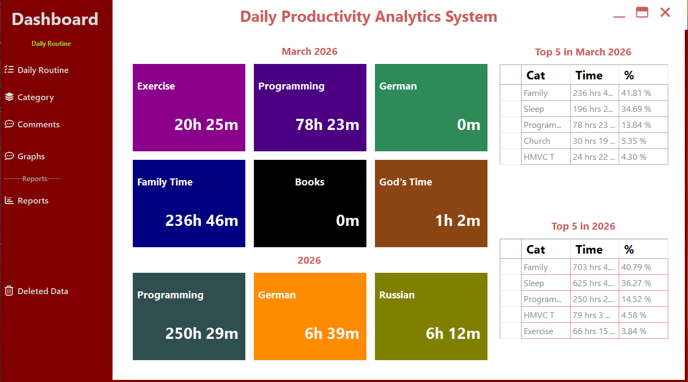
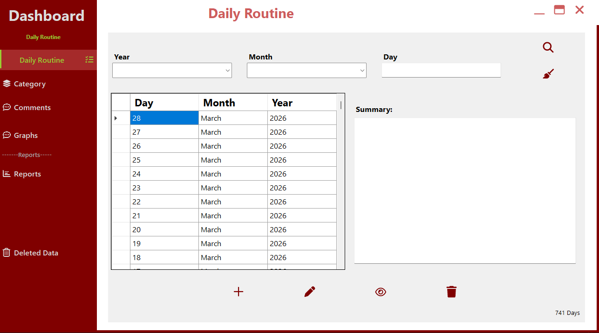
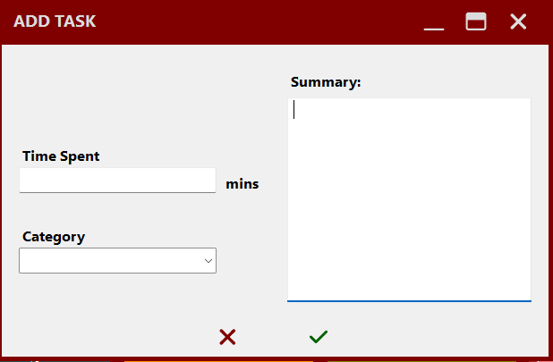
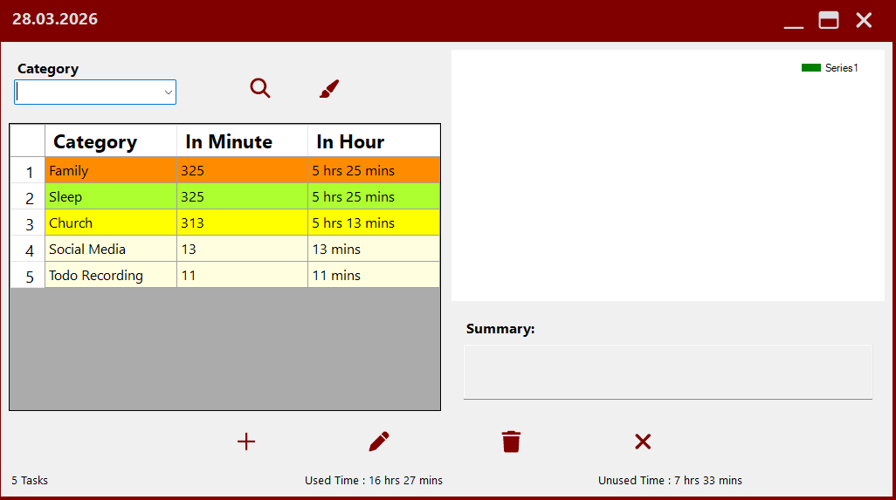
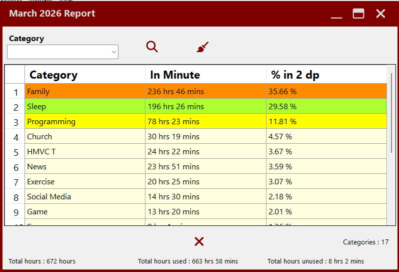
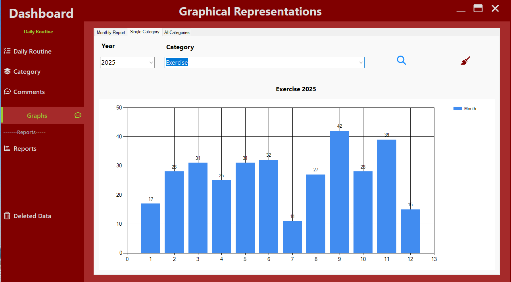
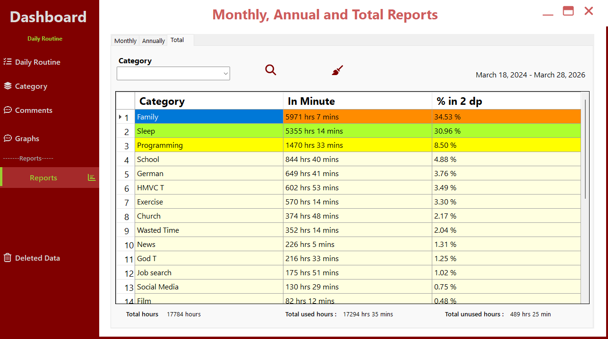

### RoutineAPP – Daily Productivity Analytics System

## Overview
RoutineAPP is a production-grade desktop analytics system for structured time tracking 
and advanced productivity reporting.

Originally designed for personal productivity management with the integration of N-tier design 
pattern, the system has evolved into a Clean Architecture–based application, emphasizing 
maintainability, scalability, and clear separation of concerns.

The application has been actively used in a real-world production environment for over 
two years, demonstrating long-term stability, reliability, and practical usability.


## 🏠 Dashboard Overview
Displays total hours per category, yearly summaries, and average monthly statistics.





## 📅 Task Entry & View
Interface for adding each task with optional summary and daily tasks view.

<p align="center">
  
  
  
</p>


## Reports
Aggregated monthly and annual time distribution per category, and 
Bar chart visualization of annual category performance


<p align="center">
  
  
  
</p>


## Architecture (Clean Architecture)

The system follows Clean Architecture principles, organizing the codebase into distinct layers with strict dependency direction:

Dependencies flow inward — outer layers depend on inner layers, never the reverse.

### 1. Core Layer (Domain)

📁 Core/Entities

- Contains enterprise business entities
- Represents the core domain model
- No dependencies on other layers

Examples:

Category, DailyRoutine, Task, Month, Year

- ✅ Pure business objects
- ✅ Framework-independent
- ✅ Highly stable

### 2. Application Layer

📁 Application/

Interfaces
- Defines contracts for:
  - Services (e.g., ITaskService)
  - Repositories (e.g., ITaskRepository)

Services
  - Implements use cases / business workflows
- Handles:
    - Validation
  - Aggregation
  - Reporting logic

DTOs
- Structured data transfer between layers
- Prevents leakage of domain entities to UI

- ✅ Central orchestration layer
- ✅ Depends only on Core
- ❌ No dependency on Infrastructure or UI

### 3. Infrastructure Layer

📁 Infrastructure/

- Implements Application interfaces
- Handles:
  - Database access
  - Repository implementations
  - External dependencies

Components:
- Data → APPContext (Entity Framework / EDMX)
- Repositories → Concrete repository implementations

Patterns Used:
- Repository Pattern
- DAO Pattern
- Entity Framework (Database-First)

- ✅ Depends on Application
- ❌ Not referenced by Core


### 4. Presentation Layer (UI)

📁 UI/

- Built with Windows Forms
- Responsible for:
- User interaction
- Data visualization

Forms include:

- Dashboard
- Daily Routine
- Reports
- Graphs
- Categories

- ✅ Depends on Application
- ✅ Uses Services via interfaces
- ❌ No direct database access


````
        ┌──────────────────────────┐
        │        UI (Forms)        │
        └────────────▲─────────────┘
                     │
        ┌────────────┴─────────────┐
        │     Application Layer    │
        │ (Services, Interfaces,   │
        │  DTOs)                   │
        └────────────▲─────────────┘
                     │
        ┌────────────┴─────────────┐
        │        Core Layer        │
        │       (Entities)         │
        └──────────────────────────┘

        ┌──────────────────────────┐
        │    Infrastructure Layer  │
        │ (EF, Repositories, DB)   │
        └──────────────────────────┘
````

## Key Architectural Principles
- Separation of Concerns – each layer has a single responsibility
- Dependency Inversion – high-level modules do not depend on low-level modules
- Testability – business logic can be tested independently
- Maintainability – changes in UI or DB do not affect core logic
- Scalability – easy migration to Web API or .NET Core

## Analytics & Reporting Engine

The system includes a powerful analytics module built on top of the Application layer.

Features
- Daily activity tracking
- Category-based time allocation
- Monthly and yearly aggregation
- Total and average calculations
- Top-N category analysis
- Time-series filtering (Year → Month → Day)
- Graphical visualization (bar charts)
- Dashboard summaries

## Data Processing Strategy
- LINQ-based aggregation
- Database-level filtering
- Optimized grouping queries
- DTO projection for lightweight data transfer


## Database Design

Core Tables
- CATEGORY
- TASK
- DAILY_ROUTINE
- MONTH

## Design Characteristics
- Normalized relational structure
- Foreign key constraints for consistency
- Soft delete support:
  - isDeleted
  - deletedDate


## Data Flow
````
UI (Forms)
   ↓
Application Services
   ↓
Repository Interfaces
   ↓
Infrastructure (Repositories)
   ↓
Entity Framework (EDMX)
   ↓
SQL Server
````

## 🗄 Database Schema
````

    CATEGORY {
        int categoryID PK
        string categoryName
        bool isDeleted
        datetime deletedDate
    }

    MONTH {
        int monthID PK
        string monthName
    }

    DAILY_ROUTINE {
        int dailyRoutineID PK
        datetime routineDate
        string summary
        int day
        int monthID FK
        int year
        bool isDeleted
        datetime deletedDate
    }

    TASK {
        int taskID PK
        int categoryID FK
        int dailyRoutineID FK
        int monthID FK
        int year
        int day
        decimal timeSpent
        string summary
        bool isDeleted
        datetime deletedDate
    }

    MONTH ||--o{ DAILY_ROUTINE : contains
    DAILY_ROUTINE ||--o{ TASK : includes
    CATEGORY ||--o{ TASK : classifies
    MONTH ||--o{ TASK : groups
````

## UI Features
Dashboard
- Monthly and yearly summaries
- Top categories
- Productivity overview

Daily Routine
- Add and manage daily tasks
- Track categorized time

Reports
- Monthly and yearly breakdown
- Total usage analytics

Graphs
- Visual insights using charts

## Technical Highlights
- Clean Architecture implementation
- Repository + Service pattern combination
- DTO-based data transfer
- LINQ-powered analytics engine
- Soft delete data strategy
- Production-tested system (2+ years)

## Technologies Used
- C#
- .NET Framework
- Windows Forms
- Entity Framework (EDMX / Database-First)
- Microsoft SQL Server
- LINQ
- WinForms Charting

## Production Experience

This system has been used continuously in real-world scenarios for over two years, proving:

- Stability under long-term usage
- Reliable analytics output
- Clean and maintainable architecture
- Practical usability for productivity tracking

## Installation
Prerequisites
- Windows OS
- Visual Studio 2022+
- .NET Framework 4.7.2+
- SQL Server Express
- SSMS

````
git clone https://github.com/isoboye24/RoutineAPP.git

````
1. Open RoutineAPP.sln
2. Ensure SQL Server Express is running
3. Build (Ctrl + Shift + B)
3. Run (F5)


## License
This project is intended for portfolio and demonstration purposes only.
Unauthorized commercial use is not permitted.
